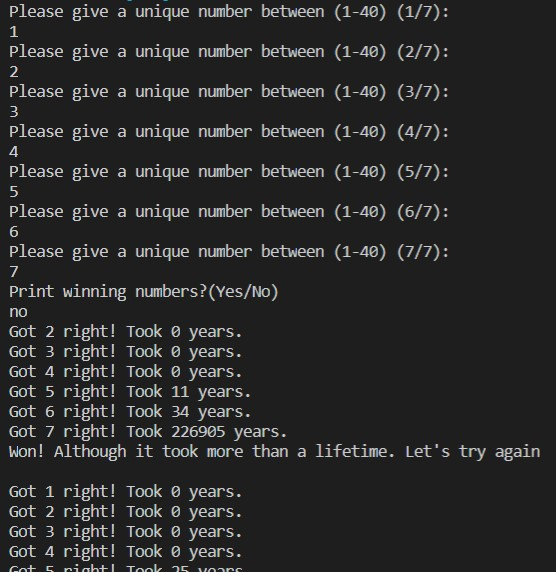
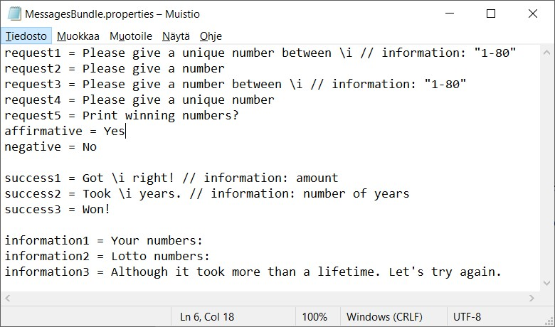

# LotteryApp
A program coded in java to calculate how many years it would take to win the lottery. The user inputs their numbers and the program comparares it to a random set of lottery numbers.

## Usage
Simply run the program and follow the instructions. The lottery numbers can also be inputted as parameters when running the program.
After getting one or more matching numbers, the program will show you how many years it took to get to that point. (assuming new lottery numbers come out once a week)

## Settings
The settings file can be found in the util folder, and can be edited with any text editing program. The settings include:

* WinningNumbersInquiry: Changing this to false stops the program from asking the user about whether the winning numbers should be displayed or not.
* LifetimeCheck: Setting this to false simply stops the program when all seven lottery numbers match the user's numbers.
* language: By default, the program supports to languages: English and Finnish. Writing "fi" after "=" sign changes the UI language to Finnish.

## Translation support
The code supports translation to other languages. Simply create a new file to the util\lang folder named MessagesBundle_**xx**.properties. The text in the file should follow the following format:
 > **\*KeyString\*** = **\*Translation...\*** **\*// possible comment\***. 
 

 
For the sake of clarity, each section should be followed by a space. If information needs to be included in the translation (e.g. "Got **5** right!") it can be given to the Properties.GetString method as a parameter. The GetString method then replaces the "\i" in the MessagesBundle file when returning the string. 
>  **Text in MessagesBundle.properties:** success1 = Got \i right!  
> **Code:** `System.out.println(Properties.getString(LangFileLocation, "success1", 5))`  
> **Output:** *Got 5 right!*  

Finally, the new language needs to be enabled in the settings file.
